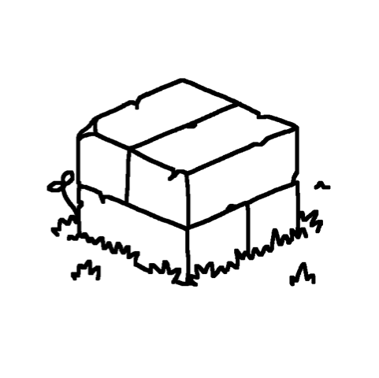

# staticbuild

<div align="center">
  
  <br><br>
  A static site generator that isn't for you!
  <br><br>
</div>

`staticbuild` is a static site generator with minimum dependencies and minimum support for anything other than my own projects.

I'm currently using this in the following projects:

- [anthonyec/website](https://github.com/anthonyec/website/tree/move-to-staticbuild-rewrite)
- [anthonyec/archive](https://github.com/anthonyec/archive)

## Features

- Small and flat dependency tree, [markdown-wasm](https://github.com/rsms/markdown-wasm/) and [mustache.js](https://github.com/janl/mustache.js/)
- Automatic page reloading when files change
- Configuration is just JavaScript™️
- Markdown files [display nicely](https://github.com/anthonyec/website/blob/main/src/_posts/2022-03-30-one-year-of-salad-room/index.md) in GitHub, with images and no ugly front matter table

## Why

I was using `jekyll` for generating [my website](https://anthonycossins.com/). But after switching to a new computer, I found it very difficult to setup Ruby, Bundler and all the other junk that was required to get my site running.

So out of frustration I built my [own static site generator](https://github.com/anthonyec/static_build) within a couple of hours. It was messy but it worked. And was actually faster than `jekyll` because I don't need it to be as flexible.

This version of `staticbuild` is an attempt to clean things up while still maintaining it's minimalism-ish.

## Usage

### Building a site

```sh
staticbuild <inputDirectory> <outputDirectory> [--watch]
```

### Viewing the site

There isn't a built-in way to serve the website generated by `staticbuild`. Use a separate HTTP server to view the site locally. I like using [`http-server`](https://www.npmjs.com/package/http-server).

```sh
npx http-server -c-1 ./dist -p 8081
```

## Documentation

### Special HTML Attributes
#### `sb:src`

When building the site, `staticbuild` will if files are referenced in any `src` or `href` attribute and ensure they are downloaded. 

However, sometimes you want to refer to files without loading them in the browser. For example, preloading videos.

Use the attribute `sb:src="<PATH_TO_ASSET>"` to make `staticbuild` aware of the file and to copy it over when building the site.

```html
<video sb:src="my_cool_video.webm">
```

#### `sb:inline`

SVG images can be inlined into the document. This keeps the HTML template clean while giving access to the SVG elements to style with CSS or modify with JS.

```html
<!-- This template: -->
<div>
  
</div>

<!-- Will render: -->
<div>
  <svg width="50" height="50">
    <!-- `currentColor` will now work since the SVG has been inlined. -->
    <circle fill="currentColor"></circle>
  </svg>
</div>
```

#### `sb:buildtime`

Arbitrary JavaScript can be run at build time! You heard that correct. 

Since the Mustache template language is logic-less, this attribute provides the full power of a scripting language in a template.

The following script will get executed when the HTML page is parsed. The final rendered HTML will not contain the script.

```html
<script sb:buildtime>
  // "Hello!" will appear in the CLI instead of the browser.
  console.log("Hello!")
</script>
```

By default, script execution happens after templating, markdown rendering and extracting assets from the HTML.

DOM API access is limited because execution happens within the Node.js process. However, simple access to the DOM tree is provided via `node-html-parser`.

```html
<script sb:buildtime>
  // A `<span>` element will be added to the document at build time.
  const body = document.querySelector("body")
  body.append("<span>Hello!</span>")
</script>
```

Data can be provided to the current HTML template using the attribute `type="application/json"` along with `sb:buildtime`.

Provide data as a valid JSON object.

```html
<script sb:buildtime type="application/json">
  {
    "items": ["1", "2", "3"]
  }
</script>
```

The data can then be accessed using Mustache in the same HTML page under the `data` field.

```html
<!-- This template: -->
<ul>
  {{#data.items}}
    <li>List item number: {{.}}</li>
  {{/data.items}}
</ul>

<!-- Will render: -->
<ul>
  <li>List item number: 1</li>
  <li>List item number: 2</li>
  <li>List item number: 3</li>
</ul>
```

Build time data will be parsed before any parsing of the HTML page has happened.
